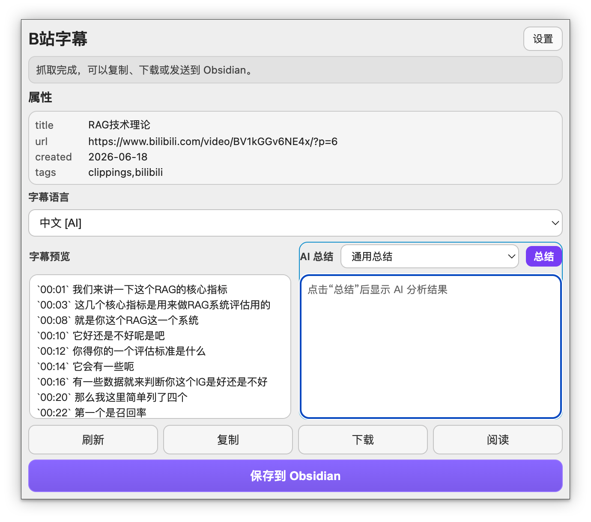

# Bilibili Obsidian Clipper｜一键保存B站字幕

[](https://github.com/haixiong1997/Bilibili-Obsidian-Clipper/releases)
[](https://chromewebstore.google.com/detail/jokophbofiphenlplmohabdcmalcbenl)
[](https://github.com/haixiong1997/Bilibili-Obsidian-Clipper/releases)

推荐官方插件市场下载：[Chrome](https://chromewebstore.google.com/detail/jokophbofiphenlplmohabdcmalcbenl?utm_source=item-share-cb) · [Edge](https://microsoftedge.microsoft.com/addons/detail/fbeeapnjdjgacilaobonekidbfjcmdjo) · [Firefox](https://addons.mozilla.org/addon/bilibili-obsidian-clipper/)

在 B 站视频页抓取字幕，预览后可复制 Markdown、下载字幕文件，并一键写入 Obsidian（Local REST API）。

> 注意：仅支持获取“有字幕轨”的 B 站视频字幕（播放器里有「字幕」选项，通常表示作者上传了外挂字幕或平台提供了 AI 字幕）；没有字幕轨的视频无法获取字幕。

## 本版本主要修改

这个版本在原有“抓取 B 站字幕并保存到 Obsidian”的基础上，增加了 AI 总结工作流：

- 设置页新增 AI 配置，支持 DeepSeek / OpenAI-compatible API。
- 支持填写 AI API 地址、API Key，并通过 `/models` 获取可用模型。
- 支持维护多个常用提示词，并选择默认提示词。
- 弹窗字幕预览改为左右分栏：
  - 左侧为原始字幕文本。
  - 右侧为 AI 总结结果。
- 点击右侧“总结”按钮后，会把当前 Bilibili 字幕发送给配置好的 AI 模型进行分析。
- AI 请求中会明确说明数据来源是哔哩哔哩（Bilibili）视频字幕，不是 YouTube。
- 鼠标停留或聚焦在哪一栏，底部 `复制 / 下载 / 阅读 / 保存到 Obsidian` 就会使用哪一栏的数据。
- 保存到 Obsidian 时不会自动覆盖原字幕预览；用户可以先对比字幕质量和 AI 总结质量，再选择保存哪一侧内容。
- AI API Key 保存在浏览器本机 `chrome.storage.local`，其他配置保存在 `chrome.storage.sync`。

## 功能

- B 站视频字幕抓取（自动识别当前分 P）
- 字幕预览、复制 Markdown
- 下载字幕文件（`srt/txt`）
- 保存到 Obsidian（Local REST API）
- AI 总结字幕，并可选择保存原字幕或 AI 总结

### 阅读视图（v1.0.18+）

沉浸式布局，支持排版调整、主题切换、字幕同步等。

> 稍后再看页面的阅读视图体验尚不完善，推荐在普通视频页使用。

## 功能图片演示



## 安装方式

### 从当前源码加载到 Chrome / Edge

如果你是从 GitHub clone 或下载本项目源码，请注意：浏览器扩展的 `manifest.json` 在 `extension/` 目录里，不在项目根目录。

1. 打开扩展管理页：
   - Chrome：`chrome://extensions/`
   - Edge：`edge://extensions/`
2. 开启“开发者模式”。
3. 点击“加载已解压的扩展程序”。
4. 选择这个目录：

   ```text
   Bilibili-Obsidian-Clipper/extension
   ```

5. 不要选择项目根目录 `Bilibili-Obsidian-Clipper`，否则会出现“清单文件缺失或不可读取 / 无法加载清单”的错误。
6. 修改代码后，回到扩展管理页点击该扩展的“重新加载”按钮，再刷新 B 站视频页面。

### Chrome / Edge

1. 在 GitHub 的 `Releases` 页面下载最新的 `*-chrome.zip` 包
2. 解压到任意本地目录
3. 打开扩展管理页：
   - Chrome：`chrome://extensions/`
   - Edge：`edge://extensions/`
4. 开启"开发者模式"
5. 点击"加载已解压的扩展程序"
6. 选择解压后的扩展目录

### Firefox

1. 在 GitHub 的 `Releases` 页面下载最新的 `*-firefox.zip` 包
2. 解压到任意本地目录
3. 打开 Firefox 附加组件管理页：`about:addons`
4. 点击右上角齿轮图标 → "调试附加组件"
5. 点击"临时加载附加组件..."
6. 选择解压后的文件夹中的 `manifest.json` 文件

## 项目结构

- `README.md` / `LICENSE`：项目说明与许可证
- `extension/`：插件源码（manifest、js、css、icons）

## Obsidian 配置

1. 在 Obsidian 社区插件市场安装并启用 `Local REST API with MCP`
2. 在插件设置中勾选 `Enable Non-encrypted (HTTP) Server`
3. 复制插件页面里的 API Key
4. 在扩展设置页填写 `Local REST API 地址`、`API Key`、`笔记目录`

## AI 总结配置

1. 打开扩展设置页。
2. 在 `AI 总结` 区域勾选“启用 AI 总结”。
3. 填写 AI API 地址，例如：

   ```text
   https://api.deepseek.com
   ```

4. 填写 AI API Key。
5. 点击“获取模型”，从下拉框选择要使用的模型。
6. 在“常用提示词”中维护一个或多个提示词，并选择默认提示词。
7. 点击“保存设置”。

只要服务兼容 OpenAI Chat Completions 格式，理论上都可以通过自定义 API 地址接入。

## 使用方式

1. 打开任意 B 站视频页并点击扩展图标
2. 面板会自动抓取并展示字幕
3. 左侧查看原始字幕，右侧点击 `总结` 生成 AI 总结
4. 鼠标停留或点击左侧字幕栏时，`复制 / 下载 / 阅读 / 保存到 Obsidian` 会使用字幕内容
5. 鼠标停留或点击右侧 AI 总结栏时，`复制 / 下载 / 阅读 / 保存到 Obsidian` 会使用 AI 总结内容
6. 保存前可以对比两侧内容质量，再决定保存原字幕还是 AI 总结

## 视频教程

- [B 站教程](https://www.bilibili.com/video/BV15qQwB4EZ9/?spm_id_from=333.1387.homepage.video_card.click&vd_source=040bc5ea7866b419558ec2682a2ccb59)

## 免责声明

> ▎ **用户自负责任条款**：本工具仅在用户已登录 B 站、且有访问权限的前提下获取数据。所有数据通过用户自己的浏览器和 cookie 获取，不经过任何第三方服务器。本工具不存储、不分发任何 B 站内容。使用本工具产生的所有后果由用户自行承担。请遵守 B 站用户协议与相关法律法规。
